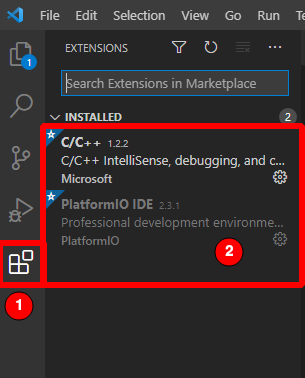
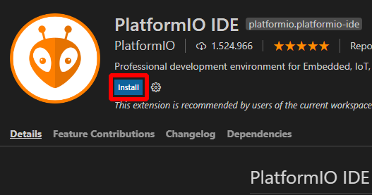
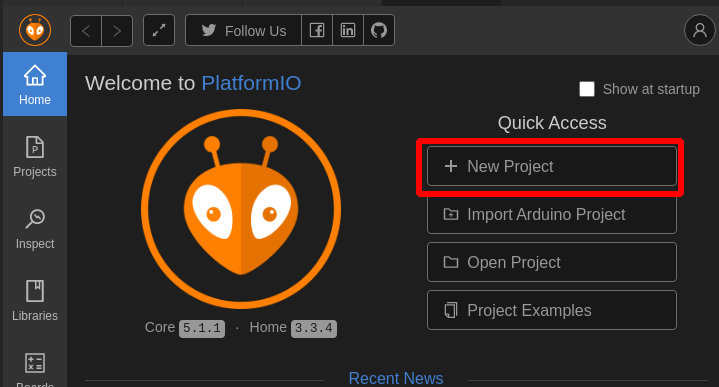
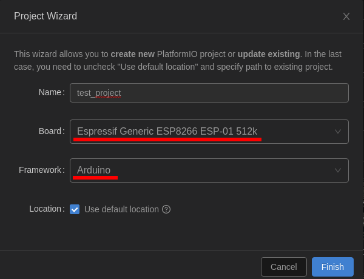
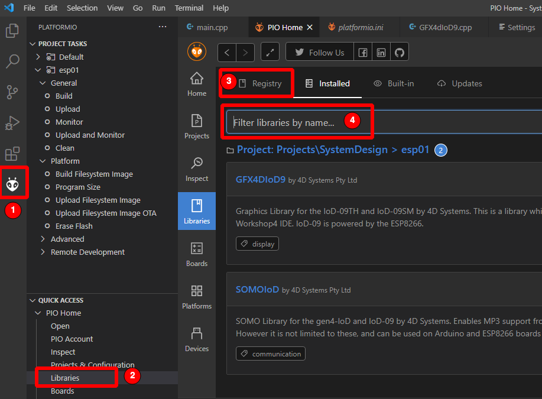
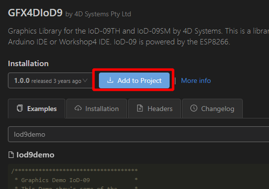
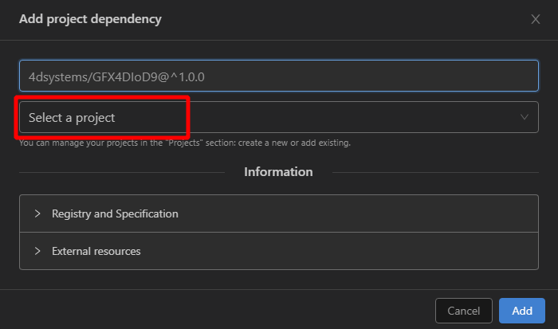
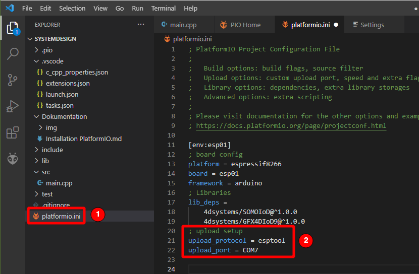
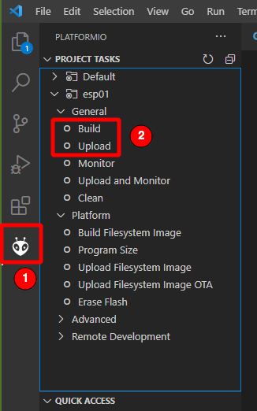

# Installation PlatformIO mit Konfiguration für "4D Systems IoD-09"

## 1. Installation Visual Studio Code
Link: https://code.visualstudio.com/
Installationsschritte ausführen.

## 2. Installation VS Code Plugins
Am linken Rand auf das Extention Menü **(1)** klicken und die 2 Pakete **(2)** suchen.  
- `C/C++` von Microsoft  
- `PlatformIO IDE` von PlatformIO  

Installiert werden die Extentions über den Install Button im Hauptfenster

PC neu starten, dass Pfade richtig eingelesen werden. (WICHTIG!)

## 3. Projekt erstellen
VS Code öffnen

im "PlatformIO Home" den Button `+ New Project` klicken

Im Wizard folgende Auswahl treffen:
Name: \<egal\> 
Board:  `Espressif Generic ESP8266 ESP-01 512k`  
Framework: `Arduino`

Der Standardspeicherort ist `Dokumente\PlatformIO\` und kann gern geändert werden.
  
Jetzt werden alle benötigten Komopnenten zur Programmierung des Mikrocontrollers heruntergeladen. Dieser Vorgang kann einige Zeit in Anpruch nehmen!

## 4. Librarys installiern
In den `PlatformIO Libraries` Tab über den PlatformIO Button **(1)** am linken Rand und im aufgehenden Menü unter `Libraries` **(2)** öffnen.
Hier können in der Suchleiste **(4)** im Tab `Registry` **(3)** beide Module mit dem Suchberegriff `IoD` gefunden werden. Die `SOMOIoD` Library wird nur für eine mp3-Audio Wiedergabe benötigt.
 

Die gefundene Library anklicken und einem Projekt verfügbar machen.
1.   
2. 

## 5. platformio.ini anpassen
In der `platformio.ini` **(1)** muss der Uploader mit Protokoll und Port festgelegt werden. 
Als Protokoll **(2)** wird `esptool` gewählt, da es eine einfache serielle Schnittstelle zum Programmieren des ESP benötigt.  
Der COM-Port **(2)** muss auf den des USB-Seriell-Wandlers geingestellt werden.

## 6. Hinweise
- Anders als bei Arduino **muss** eine Funktion deklariert sein, bevor diese genutzt werden kann. 
- über `STRG`+`Shift`+`P` lässt sich eine Eingabeaufforderung öffnen In dieser kann man `build` eingeben kann und den Befehl `PlatformIO: Build` bzw. `PlatformIO: Upload` als "Shortcut" auswählen. (Nicht `C/C++: Build and Debug`. Dies ist der falsche Compiler!)  
Alternativ über den PlatformIO-Button am linken Rand und im aufgeheneden Menü `Build` oder `Upload` auswählen.

## 7. Referenzen
- Library Doku: https://4dsystems.com.au/mwdownloads/download/link/id/205/ 
- IoD-09 Datasheet: https://4dsystems.com.au/mwdownloads/download/link/id/201/
- PlatformIO Upload Options: https://docs.platformio.org/en/latest/projectconf/section_env_upload.html