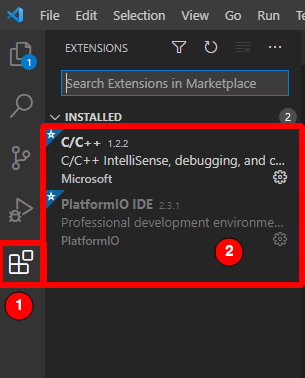
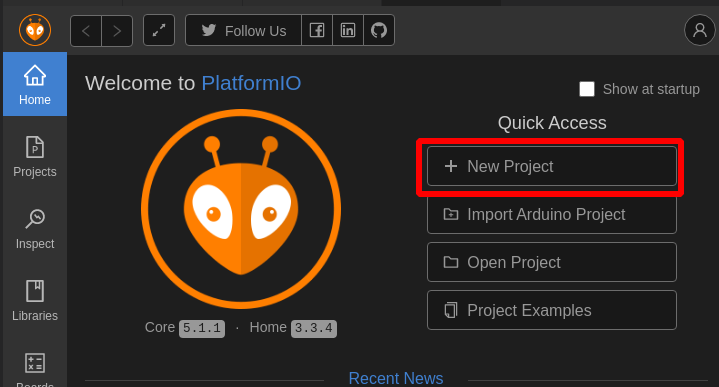
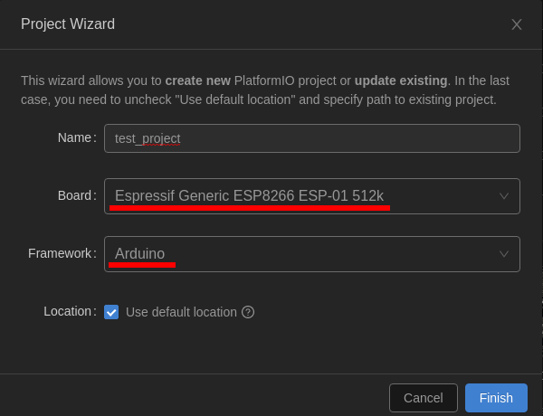

# Installation PlatformIO mit Konfiguration für "4D Systems IoD-09"

## 1. Installation Visual Studio Code
Link: https://code.visualstudio.com/
Installationsschritte ausführen.

## 2. Installation VS Code Plugins
Am linken Rand auf das Extention Menü (1) klicken und die 2 Pakete (2) suchen.  
- `C/C++` von Microsoft  
- `PlatformIO IDE` von PlatformIO

Installiert werden die Extentions über den Install Button im Hauptfenster

PC neu starten, dass Pfade richtig eingelesen werden. (WICHTIG!)

## 3. Projekt erstellen
VS Code öffnen

im "PlatformIO Home" den Button `+ New Project` klicken

Im Wizard folgende Auswahl treffen:
Name: \<egal\> 
Board:  `Espressif Generic ESP8266 ESP-01 512k`  
Framework: `Arduino`

Der Standardspeicherort ist `Dokumente\PlatformIO\` und kann gern geändert werden.

## 4. Librarys installiern
In den `PlatformIO Libraries` Tab über den PlatformIO Button (1) am linken Rand und im aufgehenden Menü unter `Libraries` (2) öffnen.
Hier können in der Suchleiste (4) im Tab `Registry` (3) beide Module mit dem Suchberegriff `IoD` gefunden werden. Die `SOMOIoD` Library wird nur für eine mp3-Audio Wiedergabe benötigt.
 

Die gefundene Library anklicken und einem Projekt verfügbar machen.
1.   
2. 

## 5. platformio.ini anpassen
In der `platformio.ini` muss der Uploader mit Protokoll und Port festgelegt werden. 

## 6. Referenzen
- Library Doku: https://4dsystems.com.au/mwdownloads/download/link/id/205/ 
- IoD-09 Datasheet: https://4dsystems.com.au/mwdownloads/download/link/id/201/
- PlatformIO Upload Options: https://docs.platformio.org/en/latest/projectconf/section_env_upload.html